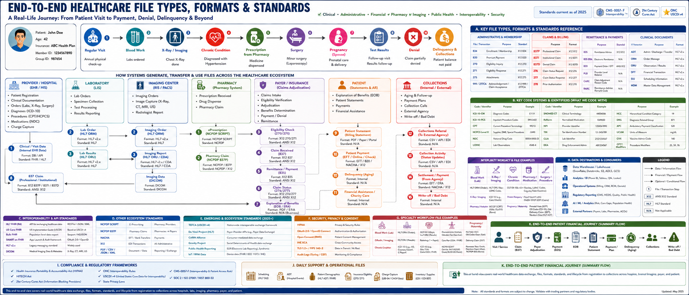

# Healthcare Synthetic File Lab

## Overview

Healthcare Synthetic File Lab is an end-to-end healthcare standards generation platform built on top of Synthea.

This repository demonstrates the complete healthcare data lifecycle using synthetic healthcare data generated by Synthea.

Starting with synthetic patients, the project generates healthcare standards, file formats, and interoperability artifacts that simulate how data moves through real healthcare ecosystems.

The repository covers:

Patient
   ↓
Coverage
   ↓
Eligibility
   ↓
Appointment
   ↓
Registration
   ↓
Encounter
   ↓
Lab Orders
   ↓
Lab Results
   ↓
Imaging
   ↓
Pharmacy
   ↓
Claims
   ↓
Remittance
   ↓
EOB
   ↓
AR Aging
   ↓
Collections
End-to-End Healthcare Journey

This repository generates artifacts for every stage of the healthcare journey.

Stage	Standards / Files
Coverage	834 (future), Payer Files
Eligibility	270 / 271
Appointment	HL7 SIU
Registration	HL7 ADT
Encounter	FHIR Encounter
Diagnoses	ICD-10, SNOMED
Procedures	CPT, HCPCS
Lab Orders	HL7 ORM
Lab Results	HL7 ORU, LOINC
Imaging Orders	HL7 ORM
Imaging Results	HL7 ORU, DICOM
Pharmacy	NDC, RxNorm, NCPDP
Claims	837P
Payments	835
EOB	JSON / CSV / TXT
Revenue Cycle	AR Aging, Collections
Interoperability	TEFCA, CARIN, Da Vinci
Quick Start
Clone Repository
git clone https://github.com/babuganesh2000/healthcare-synthetic-file-lab.git

cd healthcare-synthetic-file-lab
Create Virtual Environment

Windows:

python -m venv .venv

source .venv/Scripts/activate

pip install -r requirements.txt

Linux / Mac:

python -m venv .venv

source .venv/bin/activate

pip install -r requirements.txt
Install Synthea

Synthea is intentionally not stored inside this repository.

Clone it into the project root:

git clone https://github.com/synthetichealth/synthea.git

Expected structure:

healthcare-synthetic-file-lab
│
├── synthea
├── src
├── docs
├── config
└── README.md
Build and Test Synthea
cd synthea

./gradlew build check test

cd ..

Expected:

BUILD SUCCESSFUL
Generate Base Healthcare Dataset

Generate 100 patients:

cd synthea

./run_synthea -p 100 Texas Dallas -c ../config/synthea.properties

cd ..

Generated outputs:

FHIR
CSV
C-CDA

Locations:

data/synthea_output/fhir
data/synthea_output/csv
data/synthea_output/ccda
Generate Complete Healthcare Ecosystem

Run all generators:

python src/generators/generate_all.py

This creates:

data/generated/

├── hl7
├── x12
├── eob
├── pharmacy
├── labs
├── imaging
├── rcm
└── interoperability
End-to-End Generated Healthcare Flow
Synthetic Patient
      ↓
FHIR Patient
      ↓
HL7 ADT Registration
      ↓
HL7 SIU Appointment
      ↓
FHIR Encounter
      ↓
HL7 ORM Lab Order
      ↓
HL7 ORU Lab Result
      ↓
FHIR Observation
      ↓
Pharmacy Claim
      ↓
X12 270 Eligibility
      ↓
X12 271 Eligibility Response
      ↓
X12 837 Professional Claim
      ↓
X12 835 Remittance
      ↓
EOB
      ↓
Patient Statement
      ↓
AR Aging
      ↓
Collections
      ↓
Bad Debt
Standards Generated
HL7

Generated:

ADT_A04
SIU_S12
ORM_O01
ORU_R01
DFT_P03

Location:

data/generated/hl7
X12

Generated:

270 Eligibility Request
271 Eligibility Response
837 Professional Claim
835 Remittance Advice

Location:

data/generated/x12
Pharmacy

Generated:

NDC Reference
RxNorm Reference
NCPDP-like Claim
NCPDP SCRIPT-like NewRx

Location:

data/generated/pharmacy
Laboratory

Generated:

LOINC Results
FHIR Observation
HL7 ORU

Location:

data/generated/labs
Imaging

Generated:

DICOM Metadata
Radiology Order
Radiology Result
X-Ray Report

Location:

data/generated/imaging
Revenue Cycle

Generated:

Patient Statement
AR Aging
Denial Work Queue
Collections Placement
Bad Debt Write-Off

Location:

data/generated/rcm
Interoperability

Generated:

Consent
CARIN EOB
Da Vinci Prior Authorization
TEFCA Audit Events

Location:

data/generated/interoperability
Verify Generated Files

List everything:

find data/generated -type f

Inspect HL7:

cat data/generated/hl7/*.hl7

Inspect X12:

cat data/generated/x12/*.edi

Inspect EOB:

cat data/generated/eob/eob_patient_explanation.txt
Documentation
Patient Journey
HL7 Guide
X12 Guide
FHIR Guide
Pharmacy Guide
Imaging Guide
Revenue Cycle Guide
Interoperability Guide
Future Roadmap

See the docs/ folder.

Future Enhancements

Planned:

834 Enrollment
276 Claim Status
277 Claim Status Response
278 Prior Authorization
837I Institutional Claims
837D Dental Claims
SMART on FHIR
Bulk FHIR
HEDIS
HCC Risk Adjustment
CMS Star Ratings
Disclaimer

This project uses synthetic healthcare data generated by Synthea.

No real patient information is used or distributed.